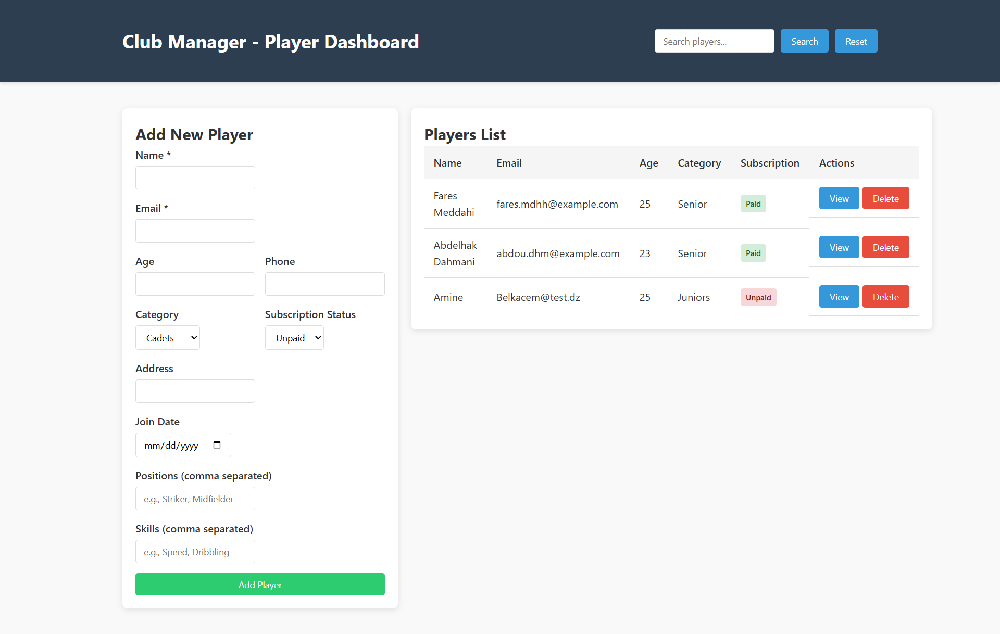
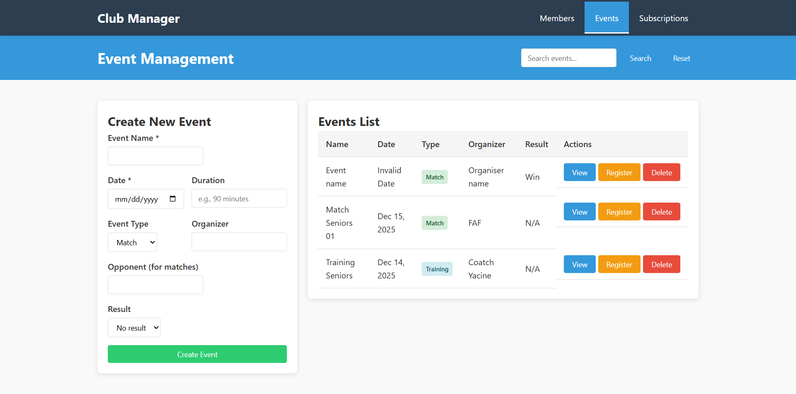
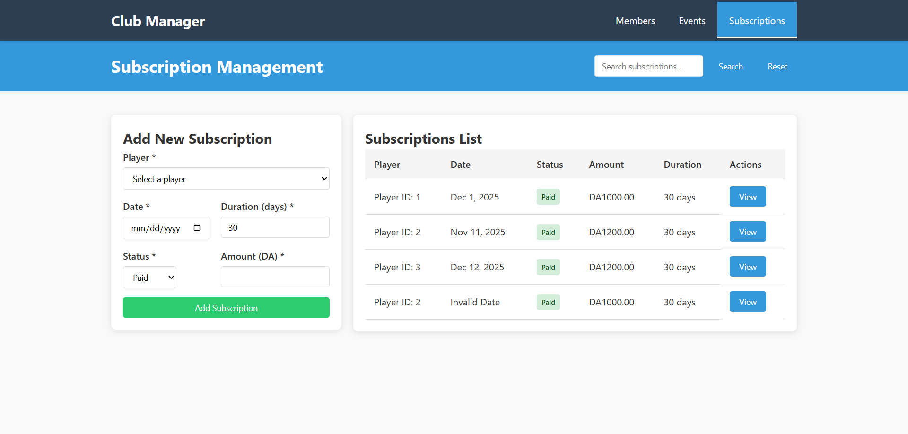

# Football Club Management System

This project is a **Football Club Management System** built using the **MVC (Model-View-Controller)** architecture. It provides a REST API for managing players only **(for now)** and allows interaction through a simple HTML dashboard.

## Dashboard
The dashboard is now separated into 03 HTML files and one CSS style file :
* `views/style.css` - defining dashboard style
* `views/members.html` – for members management



* `views/events.html` – for events management



* `views/subscriptions.html` – for subscriptions management




---

## Technologies Used

* **Flask** – REST API backend for handling requests and routing
* **SQLite** – Lightweight database to store players, events and subscriptions data
* **MVC Architecture** – Separate layers for Models, Views, and Controllers
* **HTML ,CSS and JavaScript** – Simple dashboard for managing players

---

## Features

* List all players
* View detailed player information
* Add new players with customizable attributes
* Delete players
* Search players by name
* List all events
* Add new event
* Register player into event
* Unregister player from event
* Delete event
* List all subscriptions
* Add new subscription

---

## Getting Started

1. **Run the backend API**

   ```bash
   python app.py
   ```

   The API will start at `http://localhost:5000`.

2. **Open the dashboard**
   Open `members.html` in a web browser to manage players through a simple interface.

3. **Use the API directly (optional)**
   You can also interact with the API using tools like **Postman** or **curl**.

---

## Project Structure

* `models/` – Data models (Player, Event...)
* `controllers/` – Handles business logic and database operations
* `views/` – HTML dashboard for managing players, events and subscriptions
* `db/db_helper.py` – SQLite helper to init and create db if not exists
* `app.py` – Main Flask application and route definitions
* `app.db` – The SQLite database file (Delete it and you will lose your data)

---

## Notes

* The project follows **MVC design patterns** to separate concerns and improve maintainability.
* Default values are provided for optional fields to simplify adding new players.
* All API endpoints are working and fully tested with POSTMAN and the HTML dashboard.


# API Documentation
This API docs will explain each endpoint including endpoint url, request type (GET, POST or DELETE), request body and the response (case the http request success).
## Get all players

### Request
```http
GET http://127.0.0.1:5000/players
```

### Response
```json
    [
    {
        "address": "Djebahia",
        "age": 25,
        "category": "Senior",
        "email": "fares.mdhh@example.com",
        "id": 0,
        "join_date": "2025-11-18",
        "name": "Fares Meddahi",
        "phone": "+1234567890",
        "positions": [
            "Forward",
            "Midfielder"
        ],
        "skills": [
            "Dribbling",
            "Passing",
            "Speed"
        ],
        "subscription_status": "Paid"
    }
]
```

## Get player with id

### Request
```http
GET http://127.0.0.1:5000/players/<id>
```

### Response
```json
{
    "address": "Djebahia",
    "age": 25,
    "category": "Senior",
    "email": "fares.mdhh@example.com",
    "id": 1,
    "join_date": "2025-11-18",
    "name": "Fares Meddahi",
    "phone": "+1234567890",
    "positions": [
        "Forward",
        "Midfielder"
    ],
    "skills": [
        "Dribbling",
        "Passing",
        "Speed"
    ],
    "subscription_status": "Paid"
}
```

## Insert player

### Request
```http
POST http://127.0.0.1:5000/players
```

### Request body

```json
{
    "name": "John Doe",
    "email": "john.doe@example.com",
    "age": 22,
    "phone": "+1234567890",
    "category": "Cadets",
    "address": "123 Main Street",
    "join_date": "2025-11-18",
    "positions": ["Forward", "Midfielder"],
    "skills": ["Dribbling", "Passing", "Shooting"],
    "subscription_status": "Paid"
}
```

### Response
```json
{
    "status": "ok"
}
```

## Delete player
### Request
```http
DELETE http://127.0.0.1:5000/players/<player_id>
```

### Response
```json
{
    "status": "ok"
}
```

## Search using name, skills and positions
### Request
```http
GET http://127.0.0.1:5000/players/search/<query>
```

### Response
```json
[
    {
        "address": "Djebahia",
        "age": 25,
        "category": "Senior",
        "email": "fares.mdhh@example.com",
        "id": 0,
        "join_date": "2025-11-18",
        "name": "Fares Meddahi",
        "phone": "+1234567890",
        "positions": [
            "Forward",
            "Midfielder"
        ],
        "skills": [
            "Dribbling",
            "Passing",
            "Speed"
        ],
        "subscription_status": "Paid"
    }
]
```

## Get all events
### Request
```http
GET http://127.0.0.1:5000/events
```

### Response
```json
[
    {
        "date": "2025-12-15",
        "duration": "90",
        "e_type": "Match",
        "id": 1,
        "name": "Match Seniors 01",
        "oponent": "ABRD",
        "organizer": "FAF",
        "players": [
            {
                "category": "Senior",
                "id": 2,
                "name": "Fares Meddahi"
            },
            {
                "category": "Coach",
                "id": 1,
                "name": "Coatch Yacine"
            },
            {
                "category": "Senior",
                "id": 3,
                "name": "Dahmani Abdelhak"
            }
        ],
        "result": null
    },
    {
        "date": "2025-12-14",
        "duration": "60",
        "e_type": "Training",
        "id": 2,
        "name": "Training Seniors",
        "oponent": "",
        "organizer": "Coatch Yacine",
        "players": [
            {
                "category": "Coach",
                "id": 1,
                "name": "Coatch Yacine"
            },
            {
                "category": "Senior",
                "id": 3,
                "name": "Dahmani Abdelhak"
            },
            {
                "category": "Senior",
                "id": 2,
                "name": "Fares Meddahi"
            }
        ],
        "result": null
    }
]
```

## Insert new event
### Request
```http
POST http://127.0.0.1:5000/events
```

### Request body
```json
{
    "name":"Event name",
    "date":"event date",
    "e_type":"Match",
    "organizer":"Organiser name",
    "result":"Win",
    "opponent":"Oponnent name",
    "duration":"90 min"
}
```

### Response
```json
{
    "status": "ok"
}
```

## Register player in event
### Request
```http
POST http://127.0.0.1:5000/events/<event_id>/register/<player_id>
```

### Response
```json
{
    "status": "ok"
}
```


## Unregister player in event
### Request
```http
POST http://127.0.0.1:5000/events/<event_id>/unregister/<player_id>
```

### Response
```json
{
    "status": "ok"
}
```


## Delete event
### Request
```http
DELETE http://127.0.0.1:5000/events/<event_id>
```

### Response
```json
{
    "status": "ok"
}
```

## Get all subscriptions
### Request
```http
GET http://127.0.0.1:5000/subscriptions
```

### Response
```json
[
    {
        "amount": 1000.0,
        "date": "2025-12-01",
        "duration": 30,
        "id": 1,
        "player": {
            "address": "Djebahia Bouira",
            "age": 35,
            "category": "Coach",
            "email": "yacine@email.dz",
            "id": 1,
            "join_date": "2025-01-12",
            "name": "Coatch Yacine",
            "phone": "0555555555",
            "positions": [],
            "skills": [],
            "subscription_status": "Paid"
        },
        "player_id": 1,
        "status": "Paid"
    },
    {
        "amount": 1200.0,
        "date": "2025-11-11",
        "duration": 30,
        "id": 2,
        "player": {
            "address": "Djebahi Bouira",
            "age": 25,
            "category": "Senior",
            "email": "fares.meddahi@univ-bouira.dz",
            "id": 2,
            "join_date": "2020-01-15",
            "name": "Fares Meddahi",
            "phone": "0558015936",
            "positions": [],
            "skills": [],
            "subscription_status": "Paid"
        },
        "player_id": 2,
        "status": "Paid"
    },
    {
        "amount": 1200.0,
        "date": "2025-12-12",
        "duration": 30,
        "id": 3,
        "player": {
            "address": "Ain Chriki Djebahia Bouira",
            "age": 22,
            "category": "Senior",
            "email": "dahmani.abdou@gmail.com",
            "id": 3,
            "join_date": "2021-03-21",
            "name": "Dahmani Abdelhak",
            "phone": "0555555555",
            "positions": [],
            "skills": [],
            "subscription_status": "Unpaid"
        },
        "player_id": 3,
        "status": "Paid"
    }
]
```

## Insert new subscription
### Request
```http
POST http://127.0.0.1:5000/subscriptions
```

### Request body
```json
{
    "player_id":"2",
    "date":"event date",
    "status":"Paid",
    "amount":"1000",
    "duration":"30"
}
```

### Response
```json
{
    "status": "ok"
}
```